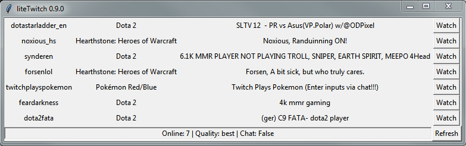

# liteTwitch

## Description

A simple GUI app for browsing your followed TwitchTV streams and subsequently launching them using livestreamer.



## Installation

1. Download the [`liteTwitch.py`](/liteTwitch.py) file. This is all you need from this repo.
2. Make sure you have [livestreamer](https://github.com/chrippa/livestreamer) installed, as well as python of course.
3. Create a `config.cfg` file in the directory you are storing `liteTwitch.py`.
  * Get your TwitchTV API authorization token for this app from <a id="gettoken" href="https://api.twitch.tv/kraken/oauth2/authorize?response_type=token&client_id=i8wca4tvk7hhie7ike8uhzy8i3pzr0n&redirect_uri=http://localhost&scope=user_read">this</a> link. You will be redirected to a page with a URL of the form:
  
    `http://localhost/#access_token=YOUR_AUTH_TOKEN&scope=user_read`

    You want to copy this authorization token into your `config.cfg` file in the following format:
    
    `token YOUR_AUTH_TOKEN`
4. Execute `liteTwitch.py`.

## Configuration Options

A `config.cfg` file is required. If none is found when the app is first run, a blank one will be created for you.

Lines inside the config file take the form:

```PARAMETER ARGUMENT```

Here is a list of currently possible `config.cfg` parameters and their arguments:

Parameter | Argument(s) | Required? | Default Value
---|---|---|---
token | <a href="#gettoken">Twitch API auth token</a> | Yes | N/A
quality | [Livestreamer quality options](http://docs.livestreamer.io/cli.html#positional-arguments) | No | best
chat | true/false | No | false

An example config file would be the following:

```
token s1g709rbev45x6m779reachwo4ezel  
quality worst  
chat true
```

It is important to note that everytime you click the link to generate a new Twitch API authorization token, your previous one will become invalid and you will subsequently need to change it inside you `config.cfg` file.

## Usage

Run the `liteTwitch.py` file, either as an executable or through the command line using `python liteTwitch.py`. If you have set up everything correctly, you will be greeted with a window such as the one in the above screenshot which lists the streams you follows on Twitch which are currently online.

Just click the *watch* button for any one stream to open a new livestreamer process for that stream. If you have set `chat true` in `config.cfg` then that channel's chat popup window should open in your browser.

Anyone with your authorization token will be able to see your followed streams through this app, so try not to share it with people.
